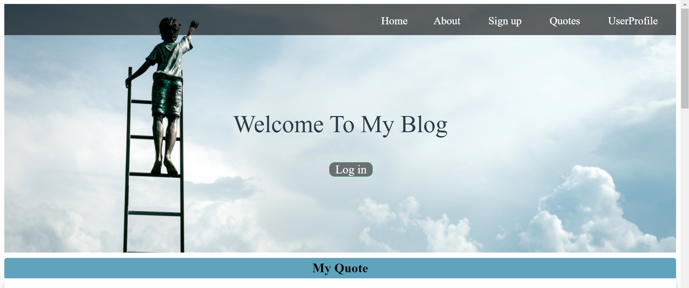
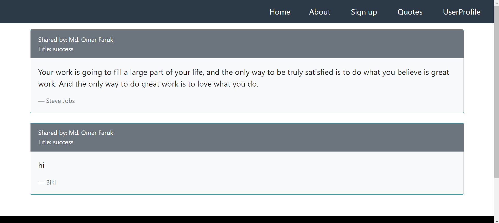
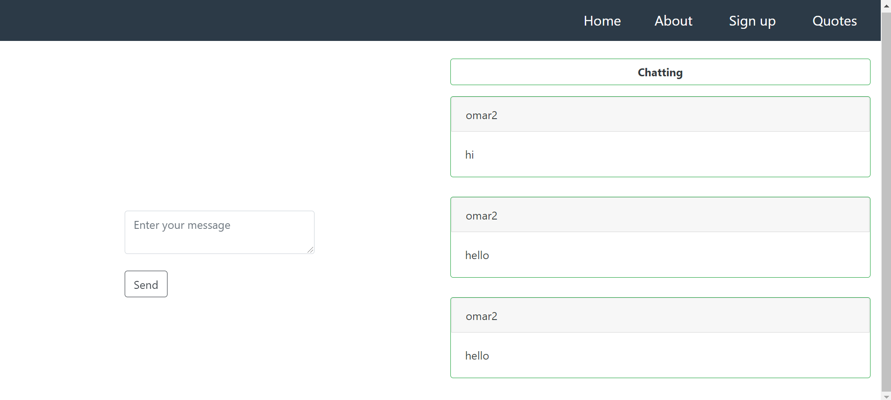
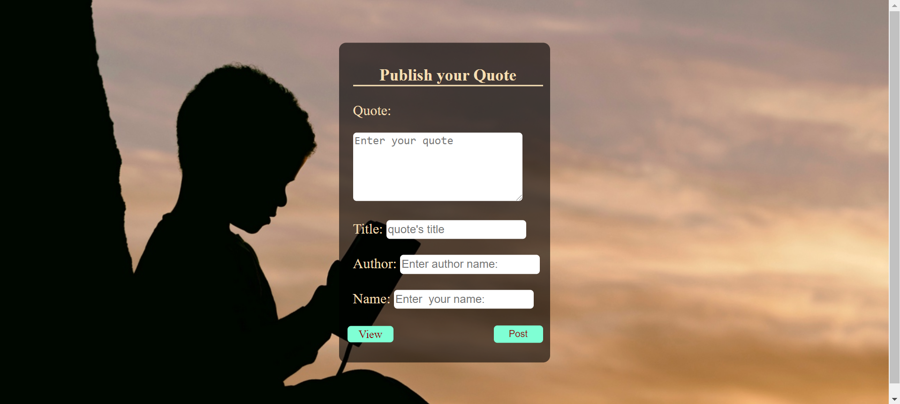

# Blog-Site
*This is Simple Blog Site Developed With Django, Bootstrap, HTML5, CSS3. This is my first project of Django. I am started learning Django by building this site.*

# Features
* You can store and view your photography collection.
* User Profile.
* Live chat system
* User-friendly.
* etc,......

# Tools
## Front-end Part
* HTML
* CSS
* Bootstrap
## Back-end
* Django
* MySQL

# Screenshots of the Project

  
  
  
  

**Copyright (c)** 2019-3019 Md. Omar Faruk

## Go Through This Site Then You Will Know About This Site Properly.
